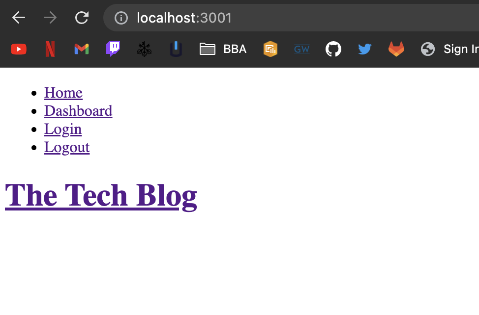
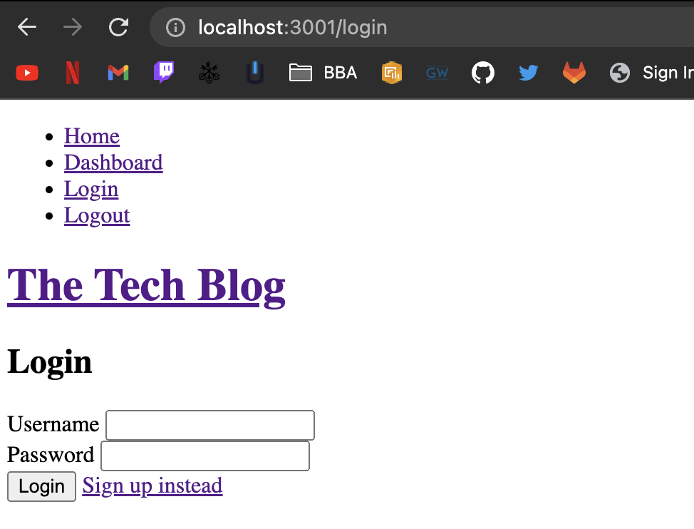
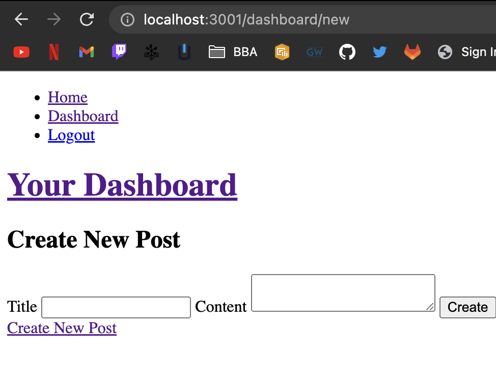
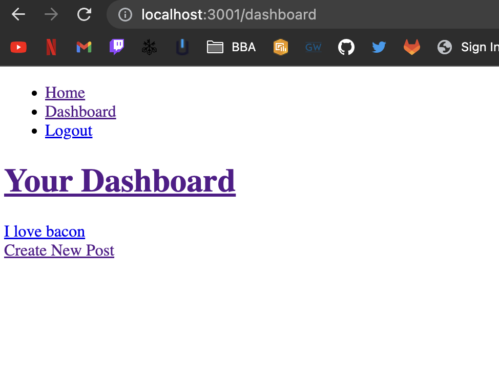

# TechBlog

## Description

The purpose of this project was to try and implement the MVC architecture which stands for model, view and controller. The project lies behind trying to make a user sign in and be able to create posts. My motivation behind this project was to try and implement the MVC model and make it work. I was successful with the technical parts but the views could still have some polishing as it pure html. During the coding process I learnt many things such as using bcrypt effectively in order to have a hashed password in the database. As well as understanding how the front end javascript interacts with the backend javascript

## Table of Contents 

- [Installation](#installation)
- [Usage](#usage)
- [Credits](#credits)
- [License](#license)

## Installation

If you wish to install this project, clone the repo and make sure to install all of the dependencies. But before installing the dependencies make sure you have Node.js installed. Here is a list of all of them:

bcrypt
connect-session-sequelize
dotenv
express
express-handlebars
express-session
mysql2
sequelize
  

## Usage

If you wish to use the website, make sure you have it first installed. 

The first thing you must do is create the SQL database, you can do so by going into the db file and copying the code within the schema.sql file.
After which you want to open the repository inside of your terminal and type in `node server.js`

After that the site should be accessible through any browser at the address http://localhost:3001

Here is an example of what the website should look like

